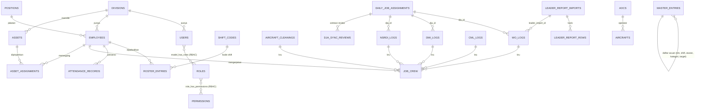

# ERD — Cabin Core

Relasi data utama. Tabel yang lahir dari relasi **many-to-many** ditandai ⇄ dan semuanya ditampilkan di aplikasi
(kolom "Tampil di" menunjuk halamannya), karena hasilnya dipakai untuk review.



## Tabel pivot (many-to-many)

| Tabel | Menghubungkan | Isi tambahan | Tampil di |
|---|---|---|---|
| `job_crew` ⇄ | pekerjaan (cleaning, WO, DMI, NSRDI, CML) ↔ karyawan | man hours bagian tiap orang | Presensi & Disiplin → profil, kolom Man hours |
| `asset_assignments` ⇄ | asset ↔ karyawan / station | jumlah, tanggal pinjam, jatuh tempo, tanggal kembali | Data Asset → Riwayat; profil karyawan |
| `roster_entries` ⇄ | karyawan ↔ tanggal ↔ shift | kode shift, tim, station | Manpower Harian, Dashboard KPI, Presensi |
| `model_has_roles`, `role_has_permissions` ⇄ | pengguna ↔ role ↔ izin | — | Manajemen Pengguna (RBAC) |

## Data master (satu tabel, banyak jenis)

`master_entries` menyimpan daftar acuan yang menjadi dasar pengaturan. Jenisnya didefinisikan di `config/master.php`
dan tiap jenis punya izin sendiri `master.<jenis>.view` / `master.<jenis>.manage`:

| Jenis | Dipakai oleh |
|---|---|
| `team` | roster, dashboard (tim mana yang dihitung kapasitas, divisi pemilik) |
| `shift` | kapasitas man hours (jam efektif per shift) |
| `attendance_status`, `attendance_rule` | penilaian presensi dan disiplin |
| `asset_category`, `asset_condition` | Data Asset (kondisi mana yang bisa dipinjamkan) |
| `kpi_target` | target closed per hari per station dan AOC (disinkron dari sheet resume) |
| `integration` | saklar sinkronisasi (terapkan otomatis closing CBM atau tunggu tinjauan) |

## Alur data

```
Planner ──(DJA, AC Movement)──► sinkron baca-saja ──► WO / DMI / NSRDI logs
Sheet hasil kerja ──► Sumber Data ──► Laporan Leader (cocokkan DJA / unplanned / CML) ──► logs + job_crew
Excel (roster, presensi, LGT, accuracy, AIEC) ──► perintah artisan ──► roster_entries, attendance_records, ...
Semua ──► Dashboard KPI (pivot per station dan tim, dibatasi menurut role)
```

## Divisi, role PIC & menu (RBAC)

5 divisi → 5 role PIC. Akses menu diatur permission `menu.*` (seeder: `RegistryPermissionSeeder::MENUS`), dan dipaksa juga di level route (middleware), bukan hanya disembunyikan di sidebar.

| Menu | Manager | Admin CGK | PIC CBM | PIC Painting | PIC AIEC | PIC Supporting | PIC Finishing |
|---|:-:|:-:|:-:|:-:|:-:|:-:|:-:|
| Cabin Maintenance (DJA, WO, DMI, CML, LGT) | ✓ | ✓ | ✓ | – | – | – | – |
| Painting (NSRDI Logs, Daily Report) | – | – | – | ✓ | – | – | – |
| Aircraft Cleaning | ✓ | ✓ | – | – | ✓ | – | – |
| NSRDI Management | ✓ | ✓ | ✓ | ✓ | – | – | – |
| ICT | ✓ | ✓ | ✓ | – | – | – | – |
| Capacity / Rotation / AC Movement | ✓ | ✓ | ✓ | – | ✓ | – | – |
| Inventory (IMS) | ✓ | ✓ | ✓ | ✓ | ✓ | ✓ (kelola toko) | ✓ |
| Analitik (Summary, KPI) | ✓ | ✓ | ✓ | ✓ | ✓ | ✓ | ✓ |

Super Admin: semua (Gate::before). Executive, Audit: Super Admin + Manager. Master data inti (airports, aircraft, categories): Super Admin.
Tes: `tests/Feature/RoleMatrixTest.php` (route × role), `tests/Feature/MasterCrudTest.php` (CRUD master, cleaning, ICT).
